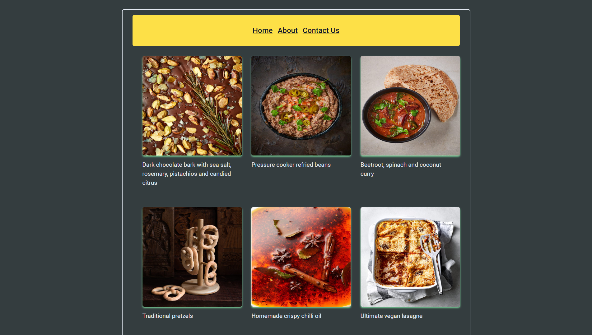

# Module#5 React Day #12 Homework: Dynamic Routing GeekFood


## Hosted Version of the Project:
[m5react-day-12-homework-dynamic-routing-geekfood](https://m5react-day-12-homework-dynamic-routing-geekfood.vercel.app/)

## Objectives
+ Implemented Dynamic Routing: We will set up dynamic routing to ensure that when a user clicks on a food card, they are directed to a unique page for that food item.
+ Displayed Recipe and Ingredients: On the new food detail page, we will design a layout to showcase the recipe and ingredients of the selected food item.
+ Combine Existing Pages: To simplify navigation and provide a cohesive user experience, we will combine all existing pages, possibly using a navigation menu or tabbed interface.


## How to install and run in yours local machine
```bash
npm install
npm run start
```

## Tech. Stack Used:
+ [React](https://react.dev/)
+ [TailwindCSS](https://tailwindcss.com/)
+ [Google Fonts](https://fonts.google.com/)
+ [Font Awesome](https://fontawesome.com/icons/)

## Author
[Abhishek kumar](https://www.linkedin.com/in/alex21c/), ([Geekster](https://geekster.in/) MERN Stack FS-14 Batch)


